# 官方單字庫擴充計畫

## 目標

把 `C:\Users\hch12\Downloads\英文單字\單字庫.pdf` 建成可追蹤、可審核、可回滾的網站資料來源。正式網站資料 `site/data/words.json` 不直接由 raw 轉錄覆蓋，必須經過 review queue、reviewed draft、approved reviewed 三段門檻。

## 目前狀態

- PDF 頁數：18 頁
- PDF SHA256：`1db6e5ab04f77a86fe83b99a13c9f076a74f2ae5dbb46dbe6952a01c8db4c9cf`
- Raw 轉錄：A-D 共 1010 筆
- 正式網站既有資料：160 筆
- Raw 中已存在於正式網站：159 筆
- Raw 中仍待審核：851 筆
- 正式網站中不在官方 raw 內：`D034:dress`

## 資料流程

```mermaid
flowchart LR
  PDF["單字庫.pdf"] --> Extract["extract_official_pdf_pages.py"]
  Extract --> Raw["official-word-bank.raw.json"]
  Raw --> Queue["official-word-bank.review-queue.json"]
  Queue --> Draft["official-word-bank.reviewed-draft.json"]
  Draft --> Auto["official-word-bank.auto-candidates.json"]
  Auto --> Review["人工/LLM/Google 批次審核"]
  Review --> Approved["official-word-bank.reviewed.json"]
  Approved --> Validate["validate_official_word_bank.py --require-reviewed"]
  Validate --> Preview["merge_official_word_bank.py"]
  Preview --> Approval["本機預覽 + 使用者照准"]
  Approval --> Apply["merge_official_word_bank.py --apply-reviewed"]
  Apply --> Words["site/data/words.json"]
```



## 檔案角色

| 檔案 | 角色 | 可否直接合併 |
| --- | --- | --- |
| `official-word-bank.raw.json` | 官方 PDF 逐字轉錄來源 | 否 |
| `official-word-bank.review-queue.json` | raw 對照正式庫後的審核清單 | 否 |
| `official-word-bank.reviewed-draft.json` | 技術可載入的網站格式草稿 | 否 |
| `official-word-bank.auto-candidates.json` | 自動產生的例句、翻譯、情境候選 | 否 |
| `words.official-draft.preview.json` | 正式庫 + draft 的本機技術預覽 | 否 |
| `official-word-bank.reviewed.json` | 已審核、可送合併器的正式候選 | 是，且必須全部 `reviewStatus=approved` |

## 安全門檻

- raw 必須連號、無重複 `sourceKey`、無重複英文單字。
- review queue 必須完整對應 raw 1010 筆。
- reviewed draft 必須有網站必要欄位、注音、逐字注音 pairs、唯一 ID。
- reviewed draft 必須維持 `reviewStatus=needs_review`，避免被誤當成已審核資料。
- auto candidates 必須維持 `reviewStatus=machine_candidate`，避免被誤當成已審核資料。
- approved reviewed 才能進入 `merge_official_word_bank.py`。
- 正式合併前必須先給使用者本機預覽，使用者說「照准」後才可 commit、push、部署。

## 指令

```powershell
py tools\validate_official_word_bank.py --require-raw --min-raw 1010
py tools\build_official_review_queue.py
py tools\validate_official_review_queue.py
node tools\build_official_reviewed_draft.js
node tools\validate_official_reviewed_draft.js
node tools\generate_official_auto_candidates.js --provider template --write-provider-requests
node tools\validate_official_auto_candidates.js
node tools\validate_context_data.js
```

或使用 npm scripts：

```powershell
npm run build:official-review-queue
npm run validate:official-review-queue
npm run build:official-reviewed-draft
npm run validate:official-reviewed-draft
npm run generate:official-auto-candidates
npm run validate:official-auto-candidates
npm run validate:contexts
```

## Definition of Done

- `validate_official_word_bank.py --require-raw --min-raw 1010` 通過。
- `validate_official_review_queue.py` 通過。
- `validate_official_reviewed_draft.js` 通過。
- `validate_official_auto_candidates.js` 通過。
- `validate_context_data.js` 通過。
- `site/data/words.json` 在使用者照准前不被官方 draft 改動。
- commit、push、部署前必須停下通知使用者。
